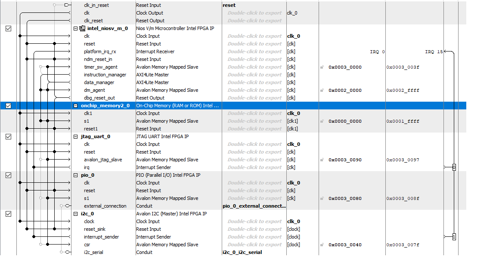
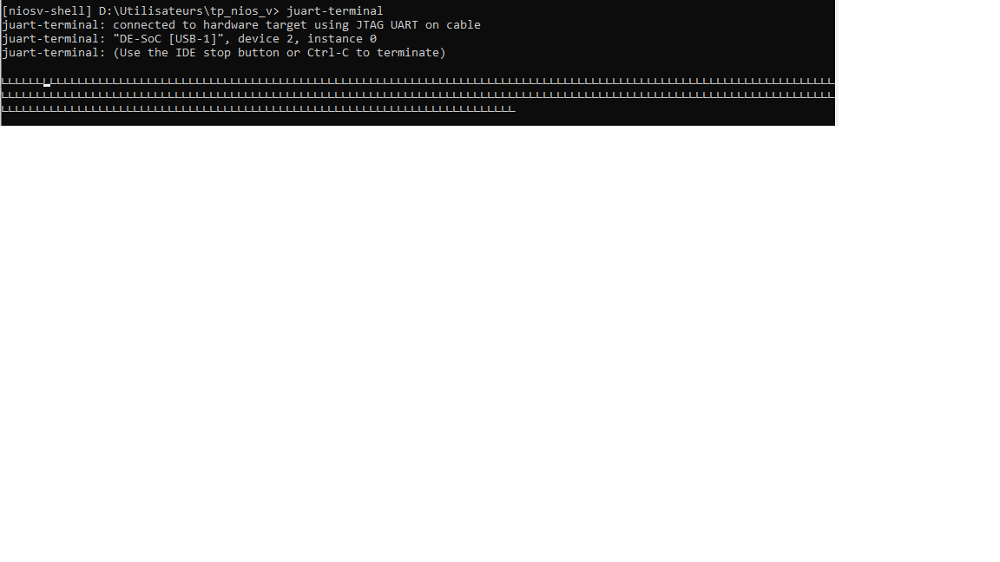

TP FPGA Avancé
Dans la première séance de TP, on a appris à utiliser un FPGA-SOC (programmation du FPGA et programmation sur la chip).

Pour vérifier que notre configuration fonctionne, on a codé un chennillard en utilisant les leds et en langage c.

```
int main (void)
{

printf("Hello, world!\n");

unsigned int chenillard = 1;

while(1) {
for (int i = 0; i < 10; i++) {
IOWR_ALTERA_AVALON_PIO_DATA(PIO_0_BASE, chenillard);
chenillard = chenillard << 1;

printf("%d\n", chenillard);
usleep(100000);
}

chenillard = 1;
}

return 0;
}
```


Le chennillard fonctionne (or à la 2ème séance il fonctionnait plus).

Projet écran magique partie 2
On ajoute une liaison I2C configurée de la manière suivante:



L'adressse de l'accéléromètre est 0x53. Après avoir ouvert un canal de transmission avec la commande alt_avalon_i2c_open, on essaye de communiquer. Or en utilisant un oscilloscope pour cela, on observe qu'il n'y en a pas dans un premier temps.

On a repris toutes les manipulations du TP et dans le procès on a cassé le chennillard et le printf. Or, on a réussi a avoir une communication I2C. Voici une capture d'écran de notre programme qui imprime le buffer rx :


